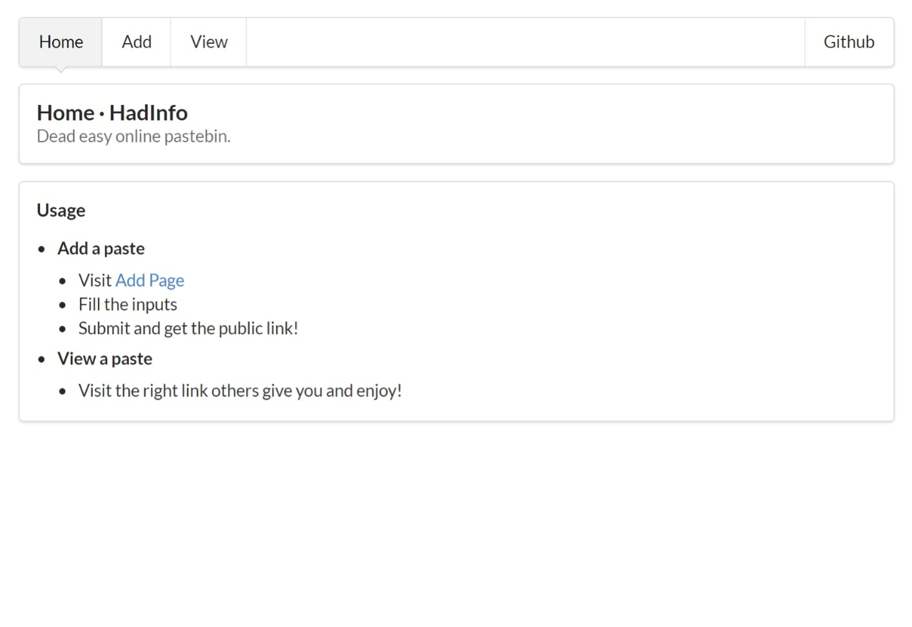

# HadInfo
> Simple online paste bin written in golang, provides both api and webpage styled by Semantic-UI

## Screenshots




## Webpages
> Note: The webpages should be put into `./page`

- View paste page `/v/<pasteId>`
- Add paste page `/add`

## TODO
- [ ] Support more meta info
- [ ] Add user system
- [ ] Add input check
- [ ] Refine the webpage

## Config
HadInfo will read the `hadInfo.ini` in the running folder.   
But it could be change anyway by command arg `config`.  

Usage:
```shell
./hadInfo -config ./anotherConfig.ini
```